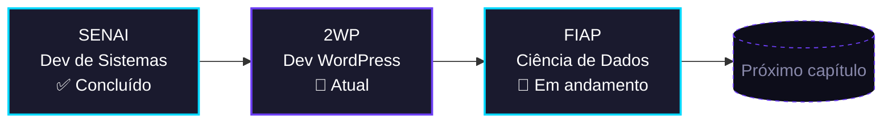

<div align="center">


<br/>


</div>
<br/>
```bash
guilherme@dev:~$ cat sobre_mim.txt
------------------------------------------------------------------
> Desenvolvedor na 2WP, atuando com WordPress no dia a dia
> Estudante de Ciência de Dados na FIAP
> Formado em Desenvolvimento de Sistemas pelo SENAI
> Integrando IA (Claude, Codex, Antigravity) ao fluxo de trabalho
> Aprendendo a transformar dado em decisão e código em produto
------------------------------------------------------------------
guilherme@dev:~$ _
```
<br/>
 Stack
<table width="100%">
<tr>
<td width="50%" valign="top">
Back-end & Dados
<br/>

</td>
<td width="50%" valign="top">
Front-end & Web
<br/>

</td>
</tr>
<tr>
<td width="50%" valign="top">
Banco de Dados
<br/>

</td>
<td width="50%" valign="top">
IA no fluxo de trabalho
<br/>
  
</td>
</tr>
</table>
<br/>
 Trajetória

<br/>
 Métricas
<div align="center">


</div>
> [!NOTE]
> Esses cartões são gerados em tempo real por serviços públicos (Vercel). Se algum aparecer quebrado, geralmente é rate-limit temporário — dá um refresh na página em alguns minutos que volta ao normal.
<br/>
 Snake da contribuição
<div align="center">

</div>
<details>
<summary><b>Como ativar (leva 2 minutos)</b></summary>
<br/>
No repositório `Gui-Lops/Gui-Lops`, crie o arquivo `.github/workflows/snake.yml` com o conteúdo abaixo.
Vá em Settings → Actions → General → Workflow permissions e marque Read and write permissions.
Rode o workflow uma vez em Actions → generate snake → Run workflow.
```yaml
name: generate snake

on:
  schedule:
    - cron: "0 0 * * *"
  workflow_dispatch:
  push:
    branches:
      - main

jobs:
  generate:
    permissions:
      contents: write
    runs-on: ubuntu-latest
    steps:
      - uses: Platane/snk@v3
        with:
          github_user_name: Gui-Lops
          outputs: |
            dist/github-contribution-grid-snake.svg
            dist/github-contribution-grid-snake-dark.svg?palette=github-dark
      - uses: crazy-max/ghaction-github-pages@v4
        with:
          target_branch: output
          build_dir: dist
        env:
          GITHUB_TOKEN: ${{ secrets.GITHUB_TOKEN }}
```
</details>
<br/>
 Formação
Instituição	Curso	Status
FIAP	Ciência de Dados	🔄 Em andamento
SENAI	Desenvolvimento de Sistemas	✅ Concluído
<br/>
<div align="center">

<br/><br/>
"Aprendendo, construindo e explorando o mundo do código e dos dados."

</div>
